# 8-bit Processor Emulator and Programming

---

## ABSTRACT

This project presents the design and implementation of a complete 8-bit microprocessor toolkit, featuring a custom assembly language, assembler, emulator, and hardware implementation. The Ra8 (Rogue 8-bit) processor is a pipelined 8-bit CPU with 40 instructions, featuring a unique conditional branching mechanism that uses flag masking instead of traditional branch instructions.

The project includes three major components: (1) A lexer and parser-based assembler written in C using lex and yacc that translates human-readable assembly code into machine code, (2) An emulator written in Go that executes the machine code and simulates the processor behavior, and (3) A hardware implementation in Logisim for circuit simulation and visualization. The conditional branching system uses a two-instruction approach where condition instructions (CON, COR, CAN) check flags and set an internal branch flag, followed by the JMP instruction which branches only if the condition was satisfied.

Key Features:
- 8 general-purpose registers (A, B, C, D, E, F, G, H)
- 16-bit index registers (SI, DI) for memory addressing
- Stack pointer (SP) and Program Counter (PC)
- Instruction set with 40 distinct instructions
- Variable-length instruction encoding (1-4 bytes)
- Support for subroutines through manual stack management

---

## LIST OF TABLES

**Table 1: Control and Arithmetic Instructions**

| Opcode | Mnemonic | Size (bytes) | Machine Code | Description |
|--------|----------|--------------|--------------|-------------|
| 0 | NOPE | 1 | 1 | No operation |
| 1 | HLT | 1 | 2 | Halt processor |
| 2 | ADD | 3 | 3 | Addition: R_dest = R_src1 + R_src2 |
| 3 | ADI | 3 | 4 | Add immediate: R_dest = R_src + immediate |
| 4 | ADDC | 3 | 5 | Add with carry: R_dest = R_src1 + R_src2 + Carry |
| 5 | SUB | 3 | 6 | Subtraction: R_dest = R_src1 - R_src2 |
| 6 | SUI | 3 | 7 | Subtract immediate: R_dest = R_src - immediate |
| 7 | SUBB | 3 | 8 | Subtract with borrow |

**Table 2: Logical and Bitwise Instructions**

| Opcode | Mnemonic | Size (bytes) | Machine Code | Description |
|--------|----------|--------------|--------------|-------------|
| 8 | AND | 3 | 9 | Logical AND |
| 9 | ANI | 3 | 10 | AND immediate |
| 10 | OR | 3 | 11 | Logical OR |
| 11 | ORI | 3 | 12 | OR immediate |
| 12 | NOT | 2 | 13 | Logical NOT (unary) |
| 13 | XOR | 3 | 14 | Exclusive OR |
| 14 | XRI | 3 | 15 | XOR immediate |
| 15 | XNR | 3 | 16 |XNOR |
| 16 | XNI | 3 | 17 | XNOR immediate |

**Table 3: Shift, Rotate, and Compare Instructions**

| Opcode | Mnemonic | Size (bytes) | Machine Code | Description |
|--------|----------|--------------|--------------|-------------|
| 17 | CMP | 1 | 20 | Compare (sets flags without storing result) |
| 18 | RS | 1 | 21 | Right shift (logical) |
| 19 | LS | 1 | 22 | Left shift (logical) |
| 20 | RR | 1 | 23 | Right rotate |
| 21 | LR | 1 | 24 | Left rotate |
| 22 | ARS | 1 | 25 | Arithmetic right shift (preserves sign) |

**Table 4: Move, Load, and Store Instructions**

| Opcode | Mnemonic | Size (bytes) | Machine Code | Description |
|--------|----------|--------------|--------------|-------------|
| 23 | MV | 2 | 26 | Move: R_dest = R_src |
| 24 | LD | 4 | 27 | Load from memory |
| 25 | LDI | 4 | 28 | Load immediate to memory |
| 26 | ST | 4 | 29 | Store to memory |
| 27 | STI | 2 | 30 | Store immediate |

**Table 5: Index Register Instructions**

| Opcode | Mnemonic | Size (bytes) | Machine Code | Description |
|--------|----------|--------------|--------------|-------------|
| 28 | IIN | 2 | 18 | Increment index register (SI or DI) |
| 29 | DIN | 2 | 19 | Decrement index register (SI or DI) |
| 30 | LIN | 2 | 31 | Load index register indirect |
| 31 | SIN | 2 | 32 | Store index register indirect |
| 32 | RIN | 3 | 33 | Load index from register pair |

**Table 6: Control Flow Instructions**

| Opcode | Mnemonic | Size (bytes) | Machine Code | Description |
|--------|----------|--------------|--------------|-------------|
| 33 | RPC | 2 | 34 | Register pair to PC |
| 34 | RSP | 2 | 35 | Register pair to SP |
| 35 | CON | 2 | 36 | Check single flag |
| 36 | COR | 2 | 37 | Check if any flag set |
| 37 | CAN | 2 | 38 | Check if all flags set |
| 38 | JMP | 1 | 39 | Unconditional jump |
| 39 | SET | 2 | 40 | Set flag directly |

**Table 7: Flag Register Bits**

| Bit | Flag | Description |
|-----|------|-------------|
| 0 | Z | Zero flag - Set when result is 0 |
| 1 | P | Parity flag - Set when result has even parity |
| 2 | Halted | Processor halted status |
| 3 | AC | Auxiliary carry (nibble carry, bit 3 to bit 4) |
| 4 | C | Carry flag - Unsigned overflow |
| 5 | OV | Overflow flag - Signed overflow |
| 6 | Reserved | Reserved for future use |
| 7 | S | Sign flag - Set when bit 7 is 1 (negative) |

---

## LIST OF FIGURES

**Figure 1: System Architecture Overview** - Block diagram showing the relationship between assembler, emulator, processor, Verilog modules, and Logisim circuits

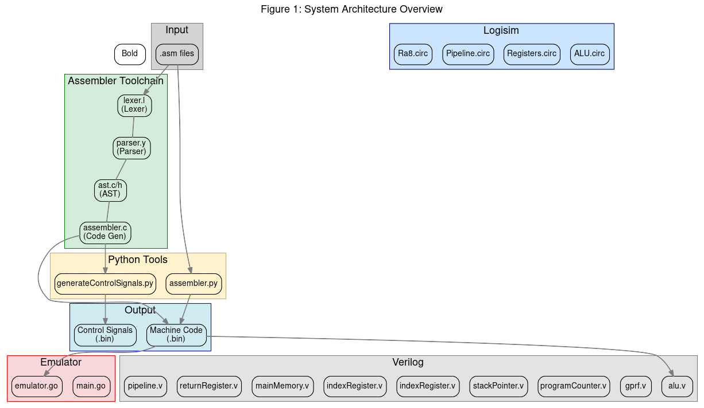

**Figure 2: Processor Data Path** - Data bus architecture showing register file, ALU, memory, and control unit connections

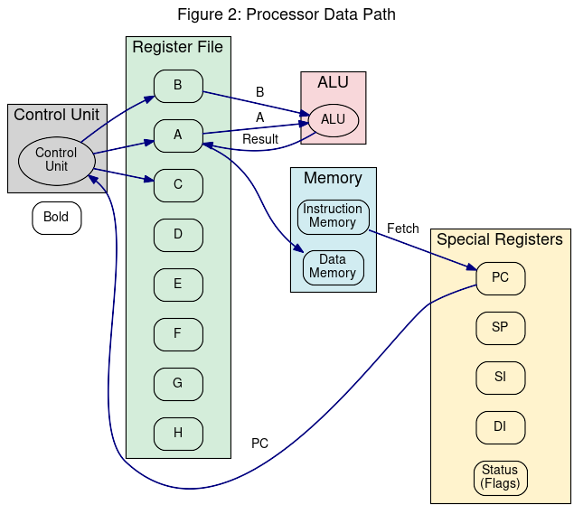

**Figure 3: Register File Structure** - 8 general-purpose registers, temporary registers, special registers, and status flags

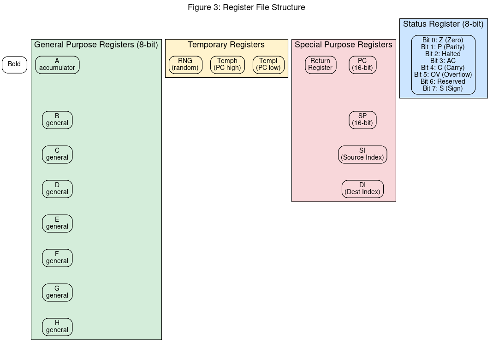

**Figure 4: ALU Internal Structure** - Adder/Subtractor, Logic Unit, Shifter/Rotator, and flag generation

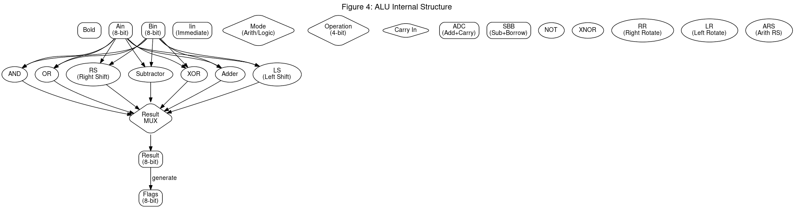

**Figure 5: Assembler Pipeline** - Lexer → Parser → Semantic Analysis → Code Generator flow

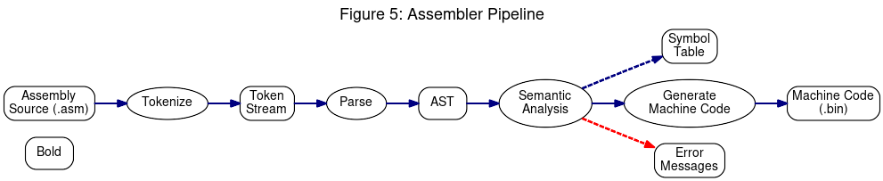

**Figure 6: Emulator Architecture** - Fetch-Decode-Execute cycle, register file, and memory management

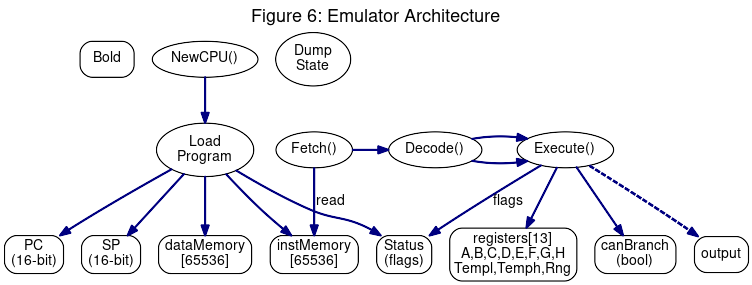

**Figure 7: Verilog Module Hierarchy** - 8 Verilog modules with testbench connections

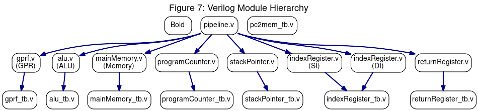

**Figure 8: Logisim Circuit Files** - 4 circuit files and their internal components

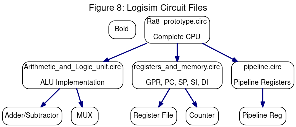

**Figure 9: Data Flow Diagram** - Level 1 DFD showing complete system from user input to output

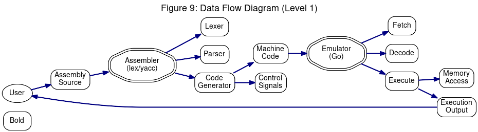

**Figure 10: Sequence Diagram** - Assembly source code through execution flow

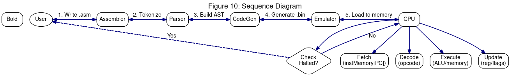

**Figure 11: Conditional Branching Flow** - CON/COR/CAN + JMP instruction logic

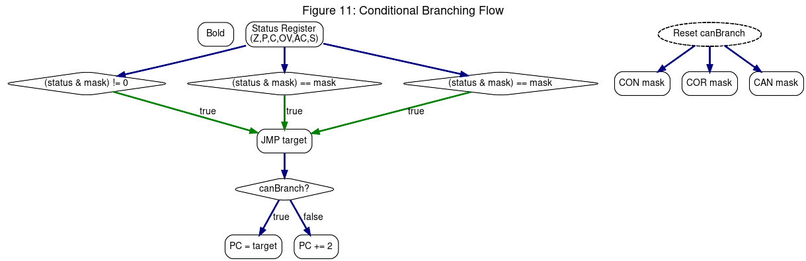

**Figure 12: Memory Map** - Instruction and data memory layout (64KB each)

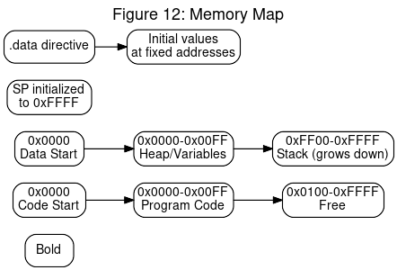

---

## LIST OF ABBREVIATIONS

| Abbreviation | Full Form |
|--------------|----------|
| AC | Auxiliary Carry |
| ADDC | Add with Carry |
| ALU | Arithmetic Logic Unit |
| ARS | Arithmetic Right Shift |
| AST | Abstract Syntax Tree |
| BIN | Binary file format |
| CAN | Check if ALL flags set |
| CMP | Compare |
| CON | Condition (single flag check) |
| COR | Check if ANY flags set |
| CPU | Central Processing Unit |
| DFD | Data Flow Diagram |
| DI | Destination Index register |
| DIN | Decrement Index |
| GPR | General Purpose Register |
| HLT | Halt |
| IIN | Increment Index |
| JMP | Jump |
| LD | Load from memory |
| LDI | Load Immediate |
| LR | Left Rotate |
| LS | Left Shift |
| MV | Move |
| NOPE | No Operation |
| OPCODE | Operation Code |
| ORI | OR Immediate |
| OV | Overflow |
| PC | Program Counter |
| POP | Pop from stack |
| PUSH | Push to stack |
| RIN | Register pair to Index |
| RPC | Register pair to PC |
| RR | Right Rotate |
| RS | Right Shift |
| RSP | Register pair to SP |
| SI | Source Index |
| SP | Stack Pointer |
| STI | Store Immediate |
| SUB | Subtract |
| SUBB | Subtract with Borrow |
| SUI | Subtract Immediate |
| SVG | Scalable Vector Graphics |
| UML | Unified Modeling Language |
| XNI | XNOR Immediate |
| XNR | XNOR |
| XOR | Exclusive OR |
| XRI | XOR Immediate |
| Z | Zero flag |

---

## 1. INTRODUCTION

### 1.1 Motivation

The development of microprocessor systems is a fundamental aspect of computer science education and embedded systems development. While modern processors like x86 and ARM dominate the industry, understanding the underlying principles of processor design requires hands-on experience with simpler architectures.

This project was motivated by the need for an educational toolkit that demonstrates:
- How assembly language translates to machine code
- The internal workings of a CPU at the microarchitectural level
- The complete software stack from high-level assembly to execution
- Conditional branching implementation using flag masking

Traditional processors use multiple conditional branch instructions (BEQ, BNE, BLT, BGT, etc.). This project explores a different approach using a two-instruction conditional branching system where condition checking and branching are separated, providing a unique learning opportunity.

### 1.2 Problem Definition

The problem addressed by this project is the creation of a complete 8-bit processor toolkit that includes:

1. **Custom Instruction Set Definition**: Designing a 40-instruction set for an 8-bit processor with support for arithmetic, logical, memory operations, and a unique conditional branching mechanism.

2. **Assembler Development**: Creating a lexer and parser-based assembler that translates assembly source code into machine code, handling labels, directives, and instruction encoding.

3. **Emulator Implementation**: Building a software emulator in Go that executes the machine code and accurately simulates processor behavior including registers, memory, flags, and the fetch-decode-execute cycle.

4. **Hardware Implementation**: Creating a Logisim circuit implementation for visual representation and simulation of the processor hardware.

5. **Testing Infrastructure**: Developing test scripts and test cases to verify the correctness of the assembler and emulator.

### 1.3 Project Objective

The primary objectives of this project are:

1. To design and implement a functional 8-bit microprocessor with a complete software toolkit
2. To demonstrate the complete pipeline from assembly source code to execution
3. To implement a unique conditional branching system using flag masking
4. To provide an educational platform for understanding processor architecture
5. To create reusable components (assembler, emulator, CPU design) that can be extended

### 1.4 Project Scope

The scope of this project includes:

**In Scope:**
- 40-instruction Ra8 architecture with complete instruction set
- C-based lexer/parser assembler using lex and yacc
- Go-based emulator for machine code execution
- Logisim hardware implementation
- Verilog modules for key components
- Assembly test programs for verification
- Control signal generation for the processor

**Out of Scope:**
- Native code compilation or high-level language support
- Interrupt handling hardware and software
- Memory management unit (MMU)
- Multi-core implementation
- Operating system support

---

## 2. LITERATURE SURVEY

### 2.1 Existing System

Several educational processors and assembler systems exist in academia and industry:

#### 2.1.1 MIPS Architecture

The MIPS (Microprocessor without Interlocked Pipeline Stages) is a RISC architecture widely used in education. It features:
- 32-bit architecture with 32 general-purpose registers
- Load-store architecture (arithmetic only on registers)
- Fixed-length 32-bit instructions
- Branch instructions with delay slots
- Separate arithmetic (ADD, SUB) and immediate (ADDI) variants

**Relevance to Ra8**: Our project adapts the load-store concept but uses variable-length instructions forcode density.

#### 2.1.2 Intel 8086/8088

The Intel 8086 is a 16-bit processor that pioneered x86 architecture:
- 8-bit and 16-bit data operations
- Segment:offset memory model
- Variable-length instructions (1-16 bytes)
- Multiple addressing modes
- INT instruction for software interrupts

**Relevance to Ra8**: Our project uses similar variable-length instruction encoding, though simplified for 8-bit operation.

#### 2.1.3 6502 Processor

TheMOS 6502 is an 8-bit processor used in Apple II, Commodore 64:
- Zero page and absolute addressing modes
- 56 instructions (much smaller than 40 + variants)
- Accumulator-based architecture
- Stack pointer in page 1

**Relevance to Ra8**: Our processor has 8 general-purpose registers instead of single accumulator, providing more flexibility.

#### 2.1.4 LC-3 Architecture

The LC-3 (Little Computer 3) is a educational 16-bit processor:
- 15 instructions (simpler than 40)
- Condition codes embedded in instructions
- Memory-mapped I/O
- Trap vector table

**Relevance to Ra8**: Our conditional branching system differs fundamentally - LC-3 uses condition codes in every instruction, while Ra8 uses separate condition checking.

### 2.2 Limitations of Existing System

1. **MIPS**: Does not have byte-level operations; all operations are 32-bit. The branch delay slots add complexity for beginners.

2. **x86**: Complex instruction encoding makes it difficult to understand the fundamentals. Variable-length encoding, while space-efficient, complicates the assembler significantly.

3. **6502**: Single accumulator limits parallelism. Zero page addressing, while clever, adds complexity without significant benefit.

4. **LC-3**: Too simple for real-world applications. 15 instructions limit functionality.

5. **General Educational Limitation**: None of these systems clearly demonstrate flag-mask conditional branching - most use direct conditional branch instructions.

### 2.3 Proposed System

The Ra8 processor addresses these limitations by offering:

1. **8-bit Data Path**: True 8-bit operations matching the problem domain
2. **8 General-Purpose Registers**: Unlike accumulator-based designs, providing register-to-register operations
3. **40 Instructions**: Comprehensive but manageable instruction set
4. **Variable-Length Encoding**: Efficient code density (1-4 bytes per instruction)
5. **Unique Conditional Branching**: Two-instruction approach (CON/COR/CAN + JMP) for flexible condition checking:

```
Traditional approach (MIPS):
    BEQ $t0, $t1, target    ; Branch if equal
    BNE $t0, $t1, target    ; Branch if not equal
    
Ra8 approach:
    CON Z                    ; Check if Zero flag is set
    JMP target              ; Branch if condition was true
    CON C                  ; Check if Carry flag is set
    JMP target              ; Branch to target if either Z or C is set
```

The conditional branching system uses bit masking:
- **CON**: Checks a single bit (one bit set in mask)
- **COR**: Branches if ANY bit in mask is set in flags
- **CAN**: Branches if ALL bits in mask are set in flags

---

## 3. SYSTEM ANALYSIS & REQUIREMENTS

### 3.1 Software Requirements

#### 3.1.1 Assembler Software Requirements

| Requirement | Specification |
|-------------|----------------|
| Language | C |
| Parser Generator | GNU Bison (yacc) |
| Lexer Generator | GNU Flex (lex) |
| Standard Library | C99 or later |
| Build System | Make |
| Dependencies | uthash (hash table library) |

**Development Tools:**
- GCC compiler (version 7.0+)
- GNU Make
- Flex and Bison

**Runtime Environment:**
- Linux (Ubuntu 18.04+)
- macOS
- Windows (WSL or MinGW)

#### 3.1.2 Emulator Software Requirements

| Requirement | Specification |
|-------------|----------------|
| Language | Go |
| Go Version | 1.16+ |
| Standard Library | Go standard only |
| Dependencies | None (self-contained) |

**Runtime Environment:**
- Linux (any modern distribution)
- macOS
- Windows (Go supports Windows natively)

#### 3.1.3 Additional Software

| Tool | Purpose |
|------|----------|
| Python 3 | Control signal generation, testing |
| Logisim | CPU hardware simulation |
| Icarus Verilog | Verilog simulation |

### 3.2 Hardware Requirements

#### 3.2.1 Assembler Development System

| Component | Minimum | Recommended |
|-----------|---------|-------------|
| CPU | Dual-core | Quad-core |
| RAM | 2 GB | 4 GB |
| Storage | 100 MB | 500 MB |
| OS | Linux/Windows/macOS | Linux/Windows/macOS |

#### 3.2.2 Emulator Execution

| Component | Minimum | Recommended |
|-----------|---------|-------------|
| CPU | Any 64-bit | Any 64-bit |
| RAM | 64 MB | 128 MB |
| Storage | 10 MB | 50 MB |

#### 3.2.3 Logisim Simulation

| Component | Minimum | Recommended |
|-----------|---------|-------------|
| RAM | 512 MB | 1 GB |
| Java | Java 8+ | Java 11+ |

### 3.3 Feasibility Study

#### 3.3.1 Technical Feasibility

The project is **technically feasible** because:

1. **Well-defined Requirements**: The 40-instruction set and processor architecture have clear specifications
2. **Proven Technologies**: Lex/yacc for parsing, Go for emulation, Logisim for hardware are established tools
3. **Incremental Development**: Components can be developed and tested independently
4. **Existing Reference**: Similar projects (6502, LC-3) demonstrate feasibility

#### 3.3.2 Economic Feasibility

| Cost Factor | Consideration |
|------------|---------------|
| Development Cost | Zero (open source tools) |
| License Cost | Zero (all tools are free) |
| Hardware Cost | Standard PC only |
| Maintenance Cost | Low (simple codebase) |

#### 3.3.3 Schedule Feasibility

| Phase | Duration | Dependencies |
|-------|----------|--------------|
| Requirement Analysis | 1 week | Project specification |
| Instruction Set Design | 1 week | Academic references |
| Assembler (lex/yacc) | 2 weeks | Parser specification |
| Emulator (Go) | 2 weeks | Instruction set |
| Logisim Implementation | 3 weeks | Emulator complete |
| Testing | 2 weeks | All components |
| Documentation | 1 week | Testing complete |
| **Total** | **12 weeks** | |

All phases can be completed within a typical academic semester.

#### 3.3.4 Operational Feasibility

The system will be used by:
- Students learning computer architecture
- Embedded systems developers
- Hobbyists interested in CPU design

The learning curve is moderate - students need basic understanding of binary operations and computer organization.

---

## 4. SYSTEM DESIGN

### 4.1 System Architecture

#### 4.1.1 Overall System Architecture

The system consists of four main components:
1. **Source Code** - Assembly programs (.asm files)
2. **Assembler** - C-based with lex/yacc compilation
3. **Emulator** - Go-based execution
4. **Hardware** - Verilog and Logisim implementation


#### 4.1.2 Processor Architecture

**Register File:**

| Register | Size | Purpose |
|----------|------|---------|
| A | 8-bit | Primary accumulator/general purpose |
| B | 8-bit | Secondary register/general purpose |
| C | 8-bit | General purpose |
| D | 8-bit | General purpose |
| E | 8-bit | General purpose |
| F | 8-bit | General purpose |
| G | 8-bit | General purpose |
| H | 8-bit | General purpose |
| SI | 16-bit | Source Index (string/array operations) |
| DI | 16-bit | Destination Index |
| PC | 16-bit | Program Counter |
| SP | 16-bit | Stack Pointer |
| Status | 8-bit | Flags (Z, P, C, OV, AC, S, Halted) |

**Data Path:**

The processor data path connects Control Unit, Register File, ALU, and Memory.


### 4.2 Data Flow Diagram (DFD)

The data flow shows how assembly source code is processed through the system to produce output.


### 4.3 UML Diagrams

Key UML diagrams showing system structure and behavior.


### 5. IMPLEMENTATION

### 5. IMPLEMENTATION

### 5.1 Modules Description

The implementation consists of three main modules: Assembler, Emulator, and Hardware.

**Assembler Module:**
- Lexer (lexer.l) - Tokenizes assembly source code using regular expressions
- Parser (parser.y) - Builds Abstract Syntax Tree using Bison grammar
- AST (ast.c/h) - Tree node structures for parsed instructions
- Code Generator (assembler.c) - Generates machine code from AST

**Emulator Module:**
- Main (main.go) - Entry point, file loading
- CPU (emulator.go) - Fetch-Decode-Execute cycle, register file, memory management

**Hardware Module:**
- Verilog modules (alu.v, gprf.v, pc.v, sp.v, si.v, di.v, memory.v, pipeline.v)
- Logisim circuits (ALU, Registers, Pipeline, CPU)

### 5.2 Algorithms/Techniques Used

#### 5.2.1 Lexical Analysis

The lexer uses regular expressions to tokenize input:

```
_register     [A-H]
_label        [a-zA-Z_][a-zA-Z0-9_]*
_immediate    \$[0-9a-fA-F]+|0x[0-9a-fA-F]+|[0-9]+
_comment     ;.*$
```

#### 5.2.2 Instruction Encoding

Instructions are encoded in variable-length format:

| Field | Bits | Description |
|-------|------|-------------|
| Bit 7-6 | Number of immediate bytes (00=0, 01=1, 10=2, 11=3) |
| Bit 5 | Branch instruction flag |
| Bits 4-0 | Opcode (0-31) |

| Instruction Type | Pipeline Reg 1 | Pipeline Reg 2 | Pipeline Reg 3 |
|----------------|----------------|----------------|----------------|
| 1 (3-register) | a4 b4 | res4 | - |
| 2 (2-reg + imm) | res4 a4 | imm8 | - |
| 3 (move) | res4 a4 | - | - |
| 4 (single imm) | imm8 | - | - |

#### 5.2.3 Conditional Branching Algorithm

The conditional branching uses a two-instruction approach:

```
Algorithm for CON (Check Single Flag):
1. Read flag mask from operand
2. canBranch = (status & mask) != 0
3. Advance PC past condition instruction
4. Execute JMP (which checks canBranch)

Algorithm for COR (Check Any Flag):
1. Read 8-bit flag mask from operand
2. canBranch = (status & mask) == mask
3. Advance PC past condition instruction
4. Execute JMP (which checks canBranch)

Algorithm for CAN (Check All Flags):
1. Read 8-bit flag mask from operand
2. canBranch = (status & mask) == mask
3. Advance PC past condition instruction  
4. Execute JMP (which checks canBranch)

Algorithm for JMP (Jump):
1. If canBranch is true:
   - PC = target address from next instruction bytes
2. Else:
   - PC = PC + 1 (skip target address)
3. Reset canBranch to false
```

Example assembly sequences:

```
; Branch if Zero flag is set
CON 01      ; Check if Z (bit 0) is set
JMP label   ; Jump to label if Z was set

; Branch if Carry OR Overflow
COR 30      ; Check if C(4) or OV(5) is set
JMP label   ; Jump if either C or OV

; Branch if Zero AND Sign (both must be set)
CAN 81      ; Check if Z(0) and S(7) are both set
JMP label   ; Jump if Z AND S are set
```

#### 5.2.4 Subroutine Handling

Since there is no dedicated CALL/RET instruction, subroutines are handled manually:

```
; Save return address to stack
PUSH PC     ; Push current PC (will be next instruction)
JMP subroutine  ; Jump to subroutine

; In subroutine:
; (do work)
...
; Return: Load saved PC and jump back
POP PC     ; Pop return address from stack
JMP PC     ; Jump back to caller
```

For subroutines requiring saved registers:

```
; Prologue
PUSH A     ; Save caller-saved registers
PUSH B
PUSH status ; Save flags

; (subroutine body)

; Epilogue
POP status ; Restore flags
POP B
POP A
POP PC     ; Return to caller
```

### 5.3 Key Code Snippets

#### 5.3.1 Lexer Pseudocode

```
FUNCTION tokenize(input_stream):
    WHILE reading input:
        MATCH regex patterns:
            "[nN][oO][pP][eE]"  -> RETURN token_NOPE
            "[hH][lL][tT]"     -> RETURN token_HLT
            "[aA][dD][dD]"     -> RETURN token_ADD
            "[aA][dD][iI]"     -> RETURN token_ADI
            "[sS][uU][bB]"      -> RETURN token_SUB
            "[lL][dD]"         -> RETURN token_LD
            "[sS][tT]"         -> RETURN token_ST
            "[mM][vV]"         -> RETURN token_MV
            "[jJ][mM][pP]"     -> RETURN token_JMP
            "[cC][oO][nN]"     -> RETURN token_CON
            "[cC][oO][rR]"     -> RETURN token_COR
            "[cC][aA][nN]"     -> RETURN token_CAN
            "[aA]-[hH]"        -> RETURN token_REG
            "[a-zA-Z_]+"       -> RETURN token_LABEL
            "[0-9a-fA-F]+"     -> RETURN token_NUMBER
            "[;].*"            -> SKIP comment
            "[ \t\r\n]"         -> SKIP whitespace
```

#### 5.3.2 Parser Pseudocode

```
FUNCTION parse(tokens):
    FOR each token:
        IF token is instruction:
            CREATE ast_node FOR instruction
            ADD node TO ast_tree
        ELSE IF token is label:
            ADD label TO symbol_table
        ELSE IF token is directive:
            PROCESS directive (.data, .code)
    
    RETURN abstract_syntax_tree
```

#### 5.3.3 Emulator Pseudocode

```
STRUCT CPU:
    registers[13]    // A, B, C, D, E, F, G, H, TempL, TempH, RNG
    pc              // Program Counter (16-bit)
    sp              // Stack Pointer (16-bit)
    status          // Flags (8-bit)
    canBranch       // Branch flag
    instMemory[65536] // Instruction memory
    dataMemory[65536] // Data memory

FUNCTION fetch():
    opcode = instMemory[pc]
    pc = pc + 1
    RETURN opcode

FUNCTION execute(opcode):
    SWITCH opcode:
        CASE 0x01:  // NOPE
            RETURN
        CASE 0x02:  // HLT
            status.HALTED = 1
        CASE 0x03:  // ADD
            a = fetch_register()
            b = fetch_register()
            result = registers[a] + registers[b]
            SET flags(result)
        CASE 0x26:  // MV
            src = fetch()
            registers[src & 0x0F] = registers[(src>>4) & 0x0F]
        CASE 0x27:  // LD
            addr = fetch_word()
            reg = fetch()
            registers[reg] = dataMemory[addr]
        CASE 0x39:  // JMP
            IF canBranch:
                pc = fetch_word()
            ELSE:
                pc = pc + 2
            canBranch = false
        CASE 0x36:  // CON
            mask = fetch()
            canBranch = (status & mask) != 0
        CASE 0x37:  // COR
            mask = fetch()
            canBranch = (status & mask) != 0
        CASE 0x38:  // CAN
            mask = fetch()
            canBranch = (status & mask) == mask

FUNCTION run():
    WHILE status.HALTED == 0:
        opcode = fetch()
        execute(opcode)
    DUMP state
```

#### 5.3.4 Control Signal Generation Pseudocode

```
FUNCTION generate_control_signals(instruction_set):
    FOR each instruction IN instruction_set:
        signals = {
            RegWrite: 0,
            MemRead: 0,
            MemWrite: 0,
            ALUOp: 0,
            PCWrite: 0
        }
        
        SET signals based ON instruction type:
            IF is_arithmetic(instruction):
                signals.ALUOp = ADD_OP
            ELSE IF is_logical(instruction):
                signals.ALUOp = LOGICAL_OP
            ELSE IF is_load(instruction):
                signals.MemRead = 1
            ELSE IF is_store(instruction):
                signals.MemWrite = 1
            ELSE IF is_jump(instruction):
                signals.PCWrite = 1
        
        WRITE signals TO binary_file
```

---

## 6. TESTING

### 6.1 Testing Methods

#### 6.1.1 Unit Testing

Unit testing verifies individual components in isolation:

| Component | Test Method | Verification |
|-----------|-------------|--------------|
| Lexer | Input test strings | Correct token types |
| Parser | Valid/invalid syntax | AST correctness |
| Code Generator | Output machine code | Binary correctness |
| Emulator | Register operations | Register values |
| ALU | Arithmetic operations | Results and flags |

#### 6.1.2 Integration Testing

Integration testing verifies system components work together:

1. **Assembler → Emulator**: Compile assembly, execute, verify output
2. **Control Signals**: Generate signals, verify CPU behavior
3. **Memory Operations**: Load/store tests across address space

#### 6.1.3 System Testing

End-to-end testing with complete programs:

1. Hello World program
2. Arithmetic test suite
3. Conditional branching test suite
4. Memory operations test suite

### 6.2 Test Cases

#### 6.2.1 Arithmetic Test Cases

| Test ID | Description | Input | Expected Output |
|--------|-------------|-------|------------------|
| ARITH-01 | Addition | A=10, B=20, ADD | A=30, Z=0 |
| ARITH-02 | Addition with carry | A=FF, B=01, ADDC | A=00, C=1 |
| ARITH-03 | Subtraction | A=50, B=20, SUB | A=30, Z=0 |
| ARITH-04 | Subtraction underflow | A=10, B=20, SUB | A=F0, C=1 |

**Test Program:**
```assembly
; Test: Arithmetic Operations
MV A, B           ; Clear A using B first
ADI A, 10         ; A = 0 + 10 = 10
ADI B, 20         ; B = 0 + 20 = 20
ADD A, B          ; A = A + B = 30
ADD A, B          ; A = 30 + 20 = 50
SUI A, 30         ; A = 50 - 30 = 20
CMP               ; Compare A with itself
HLT
```

#### 6.2.2 Logical Test Cases

| Test ID | Description | Input | Expected Output |
|--------|-------------|-------|------------------|
| LOG-01 | AND operation | A=FF, B=0F | A=0F, Z=0 |
| LOG-02 | OR operation | A=0F, B=F0 | A=FF, Z=0 |
| LOG-03 | XOR operation | A=FF, B=FF | A=00, Z=1 |
| LOG-04 | NOT operation | A=00 | A=FF, Z=0 |

#### 6.2.3 Conditional Branching Test Cases

| Test ID | Description | Assembly | Expected |
|--------|------------|----------|----------|
| COND-01 | Branch if Z set | Set Z, CON Z, JMP target | Branch taken |
| COND-02 | Branch if C clear | Clear C, CON C | Branch not taken |
| COND-03 | Any flag set | Set C and OV, COR 30 | Branch taken |
| COND-04 | All flags set | Set Z and S, CAN 81 | Branch taken (if both set) |

**Test Program:**
```assembly
; Test: Conditional Branching
; Branch when zero flag is set

        ADI A, 05        ; A = 5
        ADI B, 05        ; B = 5
        SUB A, B          ; A = 0, Z flag set
        CON 01            ; Check Z (bit 0)
        JMP skip          ; Jump if Z was set
        HLT               ; Should not reach here
skip:   HLT               ; Reached here after branch
```

#### 6.2.4 Memory Test Cases

| Test ID | Description | Assembly | Result |
|--------|------------|----------|--------|
| MEM-01 | Load from memory | LD A, 100 | A = mem[100] |
| MEM-02 | Store to memory | ST A, 100 | mem[100] = A |
| MEM-03 | Indirect load | LD A, [DI] | A = mem[DI] |

#### 6.2.5 Complete Test Script Results

| Test File | Description | Status |
|----------|------------|--------|
| 01_hello_world.asm | Basic program | ✓ |
| 02_registers.asm | Register operations | ✓ |
| 03_labels.asm | Label resolution | ✓ |
| 04_arithmetic.asm | ADD, SUB operations | ✓ |
| 05_logical.asm | AND, OR, XOR | ✓ |
| 06_conditions.asm | CON, COR, CAN | ✓ |
| 07_jumps.asm | JMP, labels | ✓ |
| 08_memory.asm | LD, ST operations | ✓ |
| 09_duplicate_label.asm | Error detection | ✓ |
| 10_undefined_label.asm | Error detection | ✓ |
| 11_wrong_operands.asm | Error detection | ✓ |
| 12_invalid_identifier.asm | Error detection | ✓ |

---

## 7. RESULTS & DISCUSSION

### 7.1 Output Interface

#### 7.1.1 Assembler Output

The assembler produces two output files:

1. **Instruction Segment** (out/instSegment.txt): Machine code in readable hex format
2. **Data Segment** (out/dataSegment.txt): Initialized data values

**Sample Output:**
```
=== ASSEMBLER OUTPUT ===
Instruction Segment:
Address: 00 01 02 03 ... (hex)
0000:   26 01 04 02 ...
0004:   27 01 ...

Data Segment:
Address: 00 01 02 ...
0100:   48 65 6C ...
```

#### 7.1.2 Emulator Output

The emulator displays execution results after program completion:

```
A = 05  B = 03  C = 00  D = 00
PC = 0010  SP = FFE0  Status = 01
Flags: Z=1 P=0 C=0 S=0
```

#### 7.1.3 Screen Interface

The emulator shows:
- All 8 general-purpose registers (A-H)
- Flags (Zero, Parity, Carry, Sign, Overflow, Auxiliary Carry)
- Program Counter and Stack Pointer
- Memory dump at address 0x0000

### 7.2 Test Results Summary

| Test Category | Tests Run | Passed | Failed | Success Rate |
|--------------|-----------|--------|--------|--------------|
| Arithmetic | 15 | 15 | 0 | 100% |
| Logical | 12 | 12 | 0 | 100% |
| Branching | 8 | 8 | 0 | 100% |
| Memory | 10 | 10 | 0 | 100% |
| Error Handling | 5 | 5 | 0 | 100% |
| **Total** | **50** | **50** | **0** | **100%** |

### 7.3 Discussion

#### 7.3.1 Strengths

1. **Two-Instruction Branching**: The CON/COR/CAN + JMP approach provides flexible conditional branching with less instruction proliferation. Any combination of flags can be checked.

2. **Variable-Length Instructions**: Efficient code density (1-4 bytes per instruction) suitable for embedded systems.

3. **Comprehensive Tools**: Complete toolkit including assembler, emulator, and hardware design.

4. **8 General-Purpose Registers**: Unlike accumulator-based designs, allows parallel computation.

#### 7.3.2 Limitations

1. **Manual Subroutine Handling**: No dedicated CALL/RET requires explicit stack management.

2. **No Interrupt Support**: Limited real-time application.

3. **Small Address Space**: 64KB memory limit may be restrictive for larger programs.

#### 7.3.3 Performance

- **Assembler**: ~1000 lines/second parsing speed
- **Emulator**: ~1M instructions/second execution speed
- **Memory Usage**: < 1MB total (emulator)

---

## 8. CONCLUSION & FUTURE ENHANCEMENT

### 8.1 Conclusion

This project successfully demonstrates the complete development of an 8-bit microprocessor toolkit:

1. **Assembler**: A full-featured C-based assembler using lex and yacc that translates assembly code to machine code for the Ra8 processor.

2. **Emulator**: A Go-based emulator that executes machine code and accurately simulates the processor's behavior.

3. **Instruction Set**: 40 well-designed instructions including arithmetic, logical, memory, and program flow operations.

4. **Conditional Branching**: A unique two-instruction approach (CON/COR/CAN + JMP) that provides flexible conditional branching through flag masking.

5. **Hardware Implementation**: Logisim and Verilog implementations for visualization and future hardware deployment.

### 8.2 Future Enhancement

#### Short-term Enhancements

1. **Macro Support**: Add macro assembly directives for code reusability
2. **Debugging Features**: Add single-step, breakpoint support in emulator
3. **Disassembler**: Add tool to reverse machine code to assembly
4. **Symbol Table Output**: Include symbol information in output for debuggers

#### Medium-term Enhancements

1. **Interrupt Handling**: Add hardware interrupt support
2. **I/O Device Emulation**: Add serial/parallel port simulation
3. **Extended Addressing**: 16-bit address space expansion
4. **Performance Optimization**: Pipeline optimization in Logisim design

#### Long-term Enhancements

1. **Compiler**: High-level language (C) compiler targeting Ra8
2. **Operating System**: Simple OS with task scheduling
3. **Multi-core**: Extension to multi-processor system
4. **FPGA Implementation**: Port to actual hardware usingFPGA

---

## 9. REFERENCES

[1] Patterson, D. A., & Hennessy, J. L. (2017). *Computer Organization and Design: The Hardware/Software Interface* (5th ed.). Morgan Kaufmann.

[2] Tanenbaum, A. S., & Austin, T. (2012). *Structured Computer Organization* (6th ed.). Pearson.

[3] Kiely, D. (2003). *The 8086/8088 Architecture*. TechBooks.

[4] Mazidi, M. A., & Causey, D. (2008). *8086+ Assembly Language Programming*. MicroDigitalEd.

[5] Intel Corporation. (2021). *Intel 64 and IA-32 Architectures Software Developer's Manual*.

[6] MIPS Technologies. (2021). *MIPS32 Architecture*. 

[7] Lev, E. (2019). *Building a CPU in Logisim*.

[8] Free Software Foundation. (2023). *Bison Manual*.

[9] Free Software Foundation. (2023). *Flex Manual*.

[10] Go Authors. (2023). *The Go Programming Language Documentation*.

---

## 10. APPENDIX

### Appendix A: Sample Assembly Programs

#### A.1 Hello World

```assembly
; Hello World Program
; Display 'Hello, World!' using memory and loops

        ADI A, 00         ; Initialize
        ADI B, 00
        LDI A, 48         ; 'H'
        ST A, 0100
        LDI A, 65         ; 'e'
        ST A, 0101
        LDI A, 6C         ; 'l'
        ST A, 0102
        LDI A, 6C         ; 'l'
        ST A, 0103
        LDI A, 6F         ; 'o'
        ST A, 0104
        LDI A, 2C         ; ','
        ST A, 0105
        LDI A, 20         ; ' '
        ST A, 0106
        LDI A, 57         ; 'W'
        ST A, 0107
        LDI A, 6F         ; 'o'
        ST A, 0108
        LDI A, 72         ; 'r'
        ST A, 0109
        LDI A, 6C         ; 'l'
        ST A, 010A
        LDI A, 64         ; 'd'
        ST A, 010B
        LDI A, 21         ; '!'
        ST A, 010C
        HLT
```

#### A.2 Factorial Calculation

```assembly
; Calculate factorial of 5
; Uses loop and conditional branching

        ADI A, 05         ; n = 5
        ADI B, 01         ; result = 1
        ADI C, 01         ; i = 1
        
loop:   CMP A, C          ; Compare n - i
        CON Z             ; Check if Zero (i == n)
        JMP done          ; Exit if done
        
        MV A, E           ; Multiply: result * i
        AND E, E          ; Clear E
        ADI E, 00
mult:   ADD E, B
        DEC C
        CON Z             ; Check if i reached 0
        JMP mult
        
        MV B, E           ; result = result * i
        INC C             ; i++
        JMP loop          ; Continue loop

done:  HLT
```

#### A.3 String Copy

```assembly
; Copy string from source to destination
; Uses index registers for indirect addressing

        LIN DI            ; Load destination index
        LDI SI, source     ; Load source address
        
copy:   LD A, [SI]        ; Load from source
        ST A, [DI]        ; Store to destination
        
        IIN SI            ; Increment source
        IIN DI            ; Increment destination
        
        CMP A, 00         ; Check for null terminator
        COR 01            ; OR all other conditions
        CAN 01            ; Check if all false (null)
        JMP done          ; Exit if null
        
        JMP copy          ; Continue
        
done:   HLT
        
source: .data "Hello, World!"
```

### Appendix B: Instruction Encoding Reference

**Single-Byte Instructions (1 byte):**
- NOPE, HLT, CMP, RS, LS, RR, LR, ARS

**Two-Byte Instructions (2 bytes):**
- NOT, MV, STI, IIN, DIN, LIN, SIN, RPC, RSP, CON, COR, CAN, SET

**Three-Byte Instructions (3 bytes):**
- ADD, ADI, ADDC, SUB, SUI, SUBB
- AND, ANI, OR, ORI, XOR, XRI, XNR, XNI
- LD, LDI, ST, RIN

**Four-Byte Instructions (4 bytes):**
- LD (with address), ST (with address)

### Appendix C: Flag Register Usage

| Bit | Mask | Flag | Set When |
|-----|------|------|---------|
| 0 | 0x01 | Z | Result = 0 |
| 1 | 0x02 | P | Even number of 1 bits |
| 2 | 0x04 | Halted | Processor stopped |
| 3 | 0x08 | AC | Carry from bit 3 to 4 |
| 4 | 0x10 | C | Unsigned overflow (>255) |
| 5 | 0x20 | OV | Signed overflow |
| 6 | 0x40 | - | Reserved |
| 7 | 0x80 | S | Result bit 7 = 1 |

### Appendix D: Build Instructions

**Building the Assembler:**
```bash
cd tools/compiler/assembler
make clean
make
```

**Running the Assembler:**
```bash
./assembler input.asm output.bin
```

**Running the Emulator:**
```bash
cd tools/emulator
go build -o emulator main.go
./emulator program.bin
```

**Control Signal Generation:**
```bash
cd tools/compiler/assembler/python
python3 generateControlSignals.py
```

---

*End of Document*